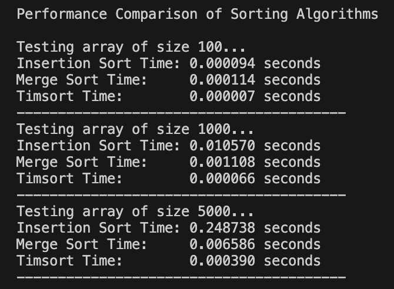

# Sorting Algorithms Performance Analysis

## Provides a comparative performance analysis of three sorting algorithms:

* Insertion Sort
* Merge Sort
* Timsort (used by Python's built-in sorted() function)

## The main Goal

To evaluate the empirical execution time of each algorithm and validate their theoretical time complexities on datasets of various sizes.

To achive this:

* Random integer arrays of sizes 100, 1000, and 5000 elements were generated.
* Each algorithm was tested using a separate copy of the original dataset to ensure fairness.
* Python's timeit module was used to measure execution time.

## Results Summary

* Insertion Sort performed well only on very small datasets.
* Merge Sort was consistently fast but slightly slower than Timsort.
* Timsort demonstrated the best performance across all dataset sizes.

## Conclusion
The experiment confirms that Timsort is the most efficient sorting algorithm for general-purpose sorting in Python. Its ability to adapt based on input data makes it superior to traditional algorithms like insertion or pure merge sort. This justifies why Timsort is the default algorithm behind Python’s built-in sorted() and list .sort() methods.
